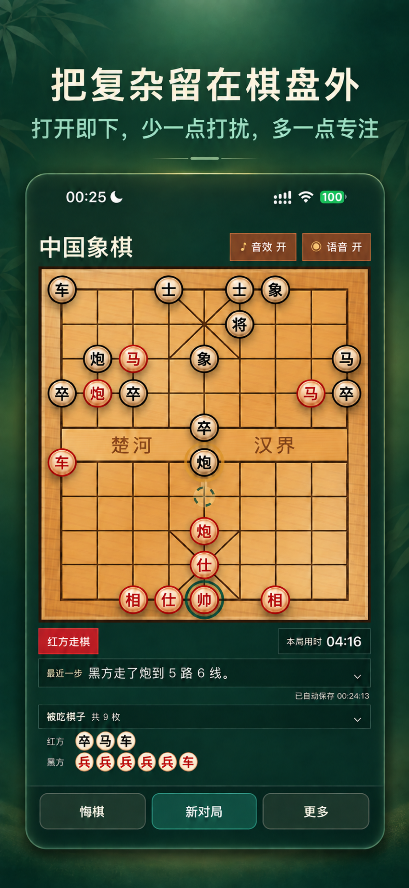

# 中国象棋

一个轻量的中国象棋人机对弈项目：棋盘、规则和交互使用原生 HTML/CSS/JavaScript 实现，桌面端由 Tauri 2 承载，电脑方优先使用 Pikafish 引擎。

项目同时支持浏览器预览、macOS/Windows 桌面构建，以及需要 Xcode 的 iOS 构建目标。

<p align="center">
  
</p>

## 功能

- 支持中国象棋基本规则、合法走法、将军、将死和胜负判定。
- 玩家执红、电脑执黑，支持玩家先走或机器先走。
- 五档电脑难度：新手、业余、进阶、高手、大师。
- Tauri 模式优先调用 Pikafish；引擎或评估文件不可用时，自动切换到内置 JavaScript 电脑方。
- 支持悔棋、重开、最近一步提示、电脑走棋轨迹和被吃棋子展示。
- 从第一步真正落子开始统计本局用时，并自动保存棋局、设置和战绩。
- 支持四套棋盘风格：经典木纹、青瓷玉盘、宣纸墨韵、玄黑夜战。
- 支持音效、语音提示和桌面端/移动端响应式布局。

## 运行方式

| 运行方式 | 电脑方 | 适用场景 |
| --- | --- | --- |
| 直接打开 `index.html` | 内置 JavaScript 电脑方 | 快速预览界面和规则；不会调用外部 Pikafish |
| Tauri 桌面端 | Pikafish（UCI/UCCI）+ 内置电脑方回退 | macOS、Windows 本地开发和打包 |
| Tauri iOS | 编入 App 的 Pikafish C++ 引擎 + NNUE | 需要 macOS、Xcode 和 Apple 签名环境 |

桌面端和 iOS 端不依赖项目自建服务器；棋局数据保存在当前设备的本地存储中。

## 快速开始

### 环境要求

- Node.js 20 或更高版本（GitHub Actions 使用 Node.js 20）。
- Rust stable、`rustup` 和 Cargo。
- macOS 桌面构建：Xcode Command Line Tools。
- Windows 桌面构建：MSVC Build Tools 和 WebView2。
- 使用仓库中的 `.nnue` 文件时，建议安装 Git LFS。

### 安装并启动桌面端

```bash
git clone git@github.com:vrwoody-lgtm/chinese_chess.git
cd chinese_chess

git lfs install
git lfs pull
npm install
npm run tauri:dev
```

`tauri:dev` 启动前会自动把根目录的前端文件同步到 Tauri 使用的 `tauri-web/` 目录。

### 浏览器预览

直接在浏览器打开 `index.html`，或把仓库根目录交给任意静态文件服务器。浏览器模式不需要 Rust，也不需要外部引擎。

## 常用命令

| 命令 | 作用 |
| --- | --- |
| `npm run start` | `npm run tauri:dev` 的别名 |
| `npm run tauri:dev` | 启动 Tauri 桌面开发模式 |
| `npm run tauri:sync` | 手动同步 `index.html`、`styles.css`、`game.js` 和资源文件 |
| `npm run tauri:build` | 构建当前平台的 Tauri 安装包 |
| `npm run tauri:build:win` | Windows 构建别名，需要在 Windows 环境执行 |
| `npm run build:win` | Windows 构建别名，需要在 Windows 环境执行 |
| `npm run build:mac` | macOS 构建别名 |
| `npm run build:mac:store` | 仅构建 macOS `.app`，供商店签名流程使用 |

根目录的 `index.html`、`styles.css` 和 `game.js` 是前端源文件。`tauri-web/` 是被 `.gitignore` 忽略的生成目录，不要直接在里面维护功能。

## 项目结构

| 路径 | 说明 |
| --- | --- |
| `index.html` | 页面结构、控制区、弹窗和移动端操作栏 |
| `styles.css` | 棋盘、棋子、主题、桌面布局和响应式样式 |
| `game.js` | 象棋规则、内置电脑方、引擎调用、计时、存档、战绩和音效 |
| `src-tauri/src/` | Tauri/Rust 入口和 Pikafish 调用逻辑 |
| `src-tauri/tauri.conf.json` | 桌面窗口、资源、图标和打包配置 |
| `src-tauri/tauri.ios.conf.json` | iOS 产品配置 |
| `src-tauri/native/` | iOS 使用的 Pikafish C++ 源码、C ABI 桥接和版本记录 |
| `engines/` | 桌面端引擎和 `pikafish.nnue` 评估文件 |
| `assets/voice/` | 语音提示文件；文件名和回退规则见其中的 README |
| `legal/` | Pikafish GPLv3 和 NNUE 许可文本 |
| `scripts/` | 前端同步、macOS 签名打包和 Release 上传脚本 |
| `.github/workflows/release.yml` | Git tag 触发的 Windows/macOS 发布工作流 |
| `RELEASE.md` | GitHub Release 的详细操作说明 |
| `THIRD_PARTY_NOTICES.md` | 第三方组件和分发注意事项 |
| `PROJECT_NOTES.md` | 面向维护者的项目背景和排障记录 |

## Pikafish 引擎

桌面端会按当前平台查找以下文件：

- macOS / 类 Unix：`engines/pikafish`
- Windows：`engines/pikafish.exe`
- Pikafish NNUE 评估文件：`engines/pikafish.nnue`

桌面端会自动尝试 UCCI，再尝试 UCI 协议。引擎无法启动、握手失败或 NNUE 缺失时，游戏仍会使用内置电脑方继续运行。

如需使用其他位置的引擎，可以通过环境变量指定：

```bash
CHESS_ENGINE_PATH=/absolute/path/to/pikafish \
PIKAFISH_NNUE_PATH=/absolute/path/to/pikafish.nnue \
npm run tauri:dev
```

`PIKAFISH_NNUE_PATH` 可以省略；引擎和 NNUE 文件放在同一目录时，程序会自动查找。Windows 构建完成后，建议检查最终安装包中的 `pikafish.exe` 和 `pikafish.nnue` 是否都存在。

## iOS 构建

iOS 不启动外部可执行文件，而是把 Pikafish C++ 源码和匹配的 NNUE 文件编入 App。当前对应的引擎来源记录在 [`src-tauri/native/PIKAFISH_SOURCE_VERSION.txt`](./src-tauri/native/PIKAFISH_SOURCE_VERSION.txt)。

在 macOS 上准备 Xcode、XcodeGen、Rust iOS targets 和 `llvm-tools` 后执行：

```bash
rustup target add aarch64-apple-ios aarch64-apple-ios-sim
rustup component add llvm-tools

npx tauri ios init --ci --skip-targets-install
npx tauri ios build --debug --target aarch64-sim --no-sign --ci
```

`--no-sign` 只适合模拟器或本地构建检查。真机运行和发布需要 Apple Developer 账号、签名证书及 provisioning profile。

当前 `src-tauri/Cargo.lock` 固定 `swift-rs 1.0.8`，用于兼容 Xcode 27。若重新生成锁文件，请重新固定该版本：

```bash
cargo update --manifest-path src-tauri/Cargo.toml -p swift-rs --precise 1.0.8
```

## 本地打包

```bash
npm run tauri:build
```

常见产物目录：

- macOS：`src-tauri/target/release/bundle/macos/`、`src-tauri/target/release/bundle/dmg/`
- Windows：`src-tauri/target/release/bundle/msi/`、`src-tauri/target/release/bundle/nsis/`

GitHub Actions 当前明确收集并发布：

- Windows：`.msi`、NSIS `.exe`
- macOS：`.dmg`、压缩后的 `*.app.zip`

### macOS 本机测试包

先构建 `.app`，再生成经过本机签名的测试安装包：

```bash
npm run build:mac:store
bash scripts/package-mac-local-test.sh
```

脚本会在 `src-tauri/target/release/bundle/macos/` 生成 `PureChineseChess-local-test.pkg`。

### Mac App Store 包

商店包需要 Apple Developer 的应用签名、安装器签名和 provisioning profile。准备好相关信息后：

```bash
npm run build:mac:store

APP_SIGN_IDENTITY="你的应用签名证书" \
INSTALLER_SIGN_IDENTITY="你的安装器签名证书" \
PROFILE_PATH="/absolute/path/to/PureChineseChess_Mac_App_Store.provisionprofile" \
bash scripts/package-mac-store.sh
```

上架前请确认 `src-tauri/tauri.conf.json` 中的 Bundle ID、签名身份、沙盒权限、引擎启动和 NNUE 读取都符合当前 Apple Developer 与 App Store Connect 配置。

## 发布 GitHub Release

`.github/workflows/release.yml` 会在推送 `v*` tag 时构建 Windows 和 macOS，并自动创建同名 Release；也可以在 GitHub Actions 页面手动运行工作流。

发布前先统一 `package.json`、`src-tauri/Cargo.toml` 和 `src-tauri/tauri.conf.json` 中的版本字段，包括 macOS 的 `bundleVersion`，然后执行：

```bash
git add .
git commit -m "chore: release vX.Y.Z"
git push

git tag vX.Y.Z
git push origin vX.Y.Z
```

如果需要在本地构建后手动上传：

```bash
npm install
npm run tauri:build
bash scripts/publish-release.sh vX.Y.Z
```

详细的 CI、手动上传和签名说明见 [`RELEASE.md`](./RELEASE.md)。

## 第三方许可

项目随包包含 Pikafish 引擎、NNUE 评估文件和 Tauri 相关组件：

- Pikafish 引擎按 GPLv3 分发，许可文本见 [`legal/Pikafish-GPLv3.txt`](./legal/Pikafish-GPLv3.txt)。
- NNUE 文件使用单独的许可声明，见 [`legal/Pikafish-NNUE-License.md`](./legal/Pikafish-NNUE-License.md)。
- iOS 静态集成的 Pikafish 源码保留在 `src-tauri/native/pikafish-source/`，其源码许可文件为 `Copying.txt`。
- 完整的第三方组件说明见 [`THIRD_PARTY_NOTICES.md`](./THIRD_PARTY_NOTICES.md)。

当前项目按免费、无广告、无内购、无付费解锁的方式准备发布。若要改变发行模式或进行商业化发布，请在发版前根据 Pikafish、GPLv3 和 NNUE 的最新条款完成许可核查；本 README 不构成法律意见。

## 常见问题

### 为什么浏览器模式没有使用 Pikafish？

外部引擎调用依赖 Tauri 注入的 `window.__TAURI__` bridge。直接打开 `index.html` 时没有该 bridge，因此会使用内置电脑方，这是预期行为。

### 为什么电脑方回退到内置电脑方？

请确认引擎文件可执行、`pikafish.nnue` 存在，并检查环境变量路径是否正确。桌面端会优先保证棋局可以继续，不会因为外部引擎暂时不可用而中断对局。

### 为什么修改前端后没有生效？

请修改根目录的 `index.html`、`styles.css` 或 `game.js`。Tauri 启动和构建会自动同步；需要手动同步时执行：

```bash
npm run tauri:sync
```

### 为什么拉取仓库后 NNUE 文件不可用？

`engines/pikafish.nnue` 由 Git LFS 管理。请安装 Git LFS 并执行：

```bash
git lfs install
git lfs pull
```

## 相关链接

- [GitHub Releases](https://github.com/vrwoody-lgtm/chinese_chess/releases)
- [Pikafish](https://github.com/official-pikafish/Pikafish)
- [Tauri](https://tauri.app/)
- [语音资源说明](./assets/voice/README.md)
- [引擎目录说明](./engines/README.md)
